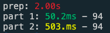

# Advent of Code Data

![Important Badge][badge] [![Maven][maven]][mavenLink]

[badge]: https://img.shields.io/badge/works-on%20my%20machine-success?style=for-the-badge
[maven]: https://img.shields.io/maven-central/v/io.github.bbstilson/aocd_2.13?color=blue&style=for-the-badge
[mavenLink]: https://search.maven.org/artifact/io.github.bbstilson/aocd_2.13

Scala version of the [python library](https://github.com/wimglenn/advent-of-code-data) by the same name.

## Usage

```scala
ivy"io.github.bbstilson::aocd:0.1.3" // mill
"io.github.bbstilson" %% "aocd" % "0.1.3" // sbt
```

Next, export your session token or add it to `~/.aocd/token`.

```bash
export AOC_SESSION_TOKEN="yoursessionstoken"
```

or

```bash
mkdir -p ~/.aocd
echo "yoursessionstoken" > ~/.aocd/token
```

Your token can be be found in your browser cookies after authenticating on the Advent of Code site.

Now go solve the problem!

```scala
import aocd.Problem

object Day1 extends Problem(2020, 1) {
  def run(input: List[String]): Unit = {
    // you can do it!
  }
}
```

## Timing

Extending the `Problem` class provides you with 3 ways to time your functions: `part1`, `part2`, and `time`.

Consider the following fake problem:

```scala
object Day99 extends aocd.Problem(2020, 99) {

  def run(input: List[String]): Unit = {
    // First, we do some prep work on our input.
    val things = prep(input)
    // Then, run part 1.
    part1(things)
    // Finally, run part 2.
    part2(things)
    ()
  }

  def prep(input: List[String]): List[Char] = time ("prep", {
    // This takes a long time.
    Thread.sleep(2000)
    input.map(_.head)
  })

  def part1(chars: List[Char]): Int = part1 {
    // Part 1 is fast.
    Thread.sleep(50)
    chars.size
  }

  def part2(chars: List[Char]): Int = part2 {
    // Part 2 is kinda slow.
    Thread.sleep(500)
    chars.size
  }
}
```

Running this day would give us the following output:



- Red: >1000ms
- Yellow: >500ms
- Green: < 100ms

## Behind the Scenes

Your data is downloaded to `~/.aocd/<YYYY>/<DD>/input.txt`. The download is only done once, subsequent runs will just read the data from that directory.

## Publishing

### Locally

Ensure you have at least [Mill](https://github.com/lihaoyi/mill/) 0.9.3.

```bash
git clone https://github.com/bbstilson/advent-of-code-data.git
cd advent-of-code-data
mill aocd.publishLocal
```

This is useful if you want to make edits and test them out.

### Maven

1) Update the `publishVersion` in `build.sc` (and in this readme)
2) Run `./bin/release.sh`
